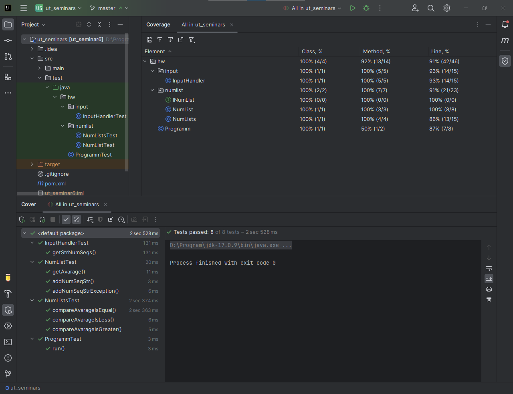
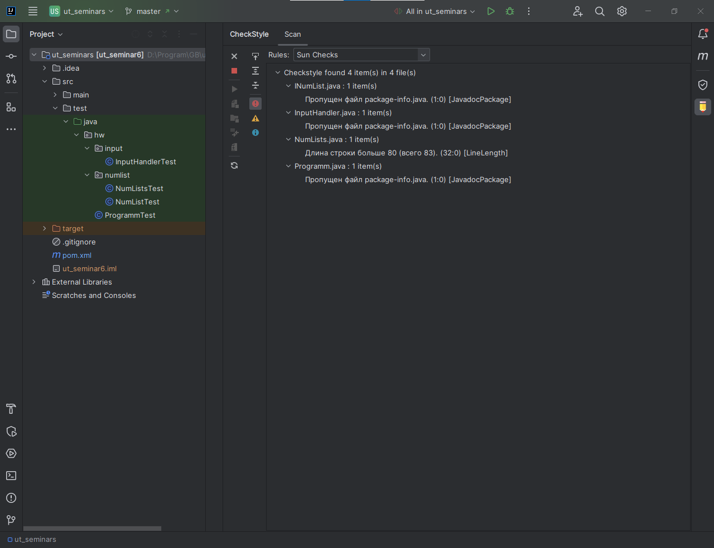

# Отчет о покрытии тестами.

## Тестирование было осуществленно для следующих сценариев.
### Класс NumLists, метод compareAvarage:
В метод передаются 2 mock объекта, реализующие интерфейс INumList для получения результатов сравнения средних значений чисел, содержащихся в них.
Осуществлены проверки assertDoesNotThrow (для проверки отсутствия ислючения при передаче заведомо валидных параметров) и assertTrue (для проверки результатов сравнения средних значений) для всех возможных результатов (первый больше, второй больше и равны).
### Класс NumList, метод addNumSeqStr:
Метод преобразует строку чисел, разделенных пробелом в целые числа и добавляет к текущему набору.
Осуществлены проверки assertDoesNotThrow при передаче правильной строки из 5-ти чисел, и assertEquals для проверки правильности каждого целого числа, добавленного к списку.
### Класс NumList, метод addNumSeqStr (Exception):
Проверка появления исключения (assertThrows) при передаче в качестве параметра строки с неверным форматом.
### Класс NumList, метод getAvarage:
Проверка правильности вычисления среднего значения чисел, содержащихся в списке (assertEquals).
### Класс InputHandler, метод getStrNumSeqs:
Метод запрашивает у пользователя две последовательности чисел поочереди, и возвращает массив строк, содержащих их.
Для тестирования в констуктор класса вместо стандартных потоков ввода-вывода, передаются ByteArrayInputStream и ByteArrayOutputStream.
Используем assertDoesNotThrow при вызове метода предварительно заполнив ByteArrayInputStream строками правильного формата. И затем assertEquals для проверки результата работы метода.
### Класс Programm, метод run:
Метод являетя входным для приложения и использует все классы, так что по сути это интеграцинный тест.
Вместо стандартных потоков ввода-вывода, передаются ByteArrayOutputStream и ByteArrayInputStream, заполненный строками последовательностей чисел.
Проверям с помощью assertDoesNotThrow остутсвие исключений, и с помощюь assertEquals сравниваем строку вывода пользователю из выходного потока ByteArrayOutputStream с ожидаемым результатом работы приложения.
# Отчет Checkstyle.

